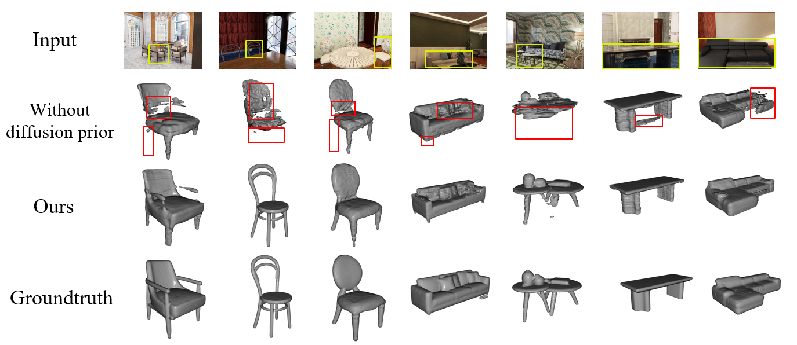
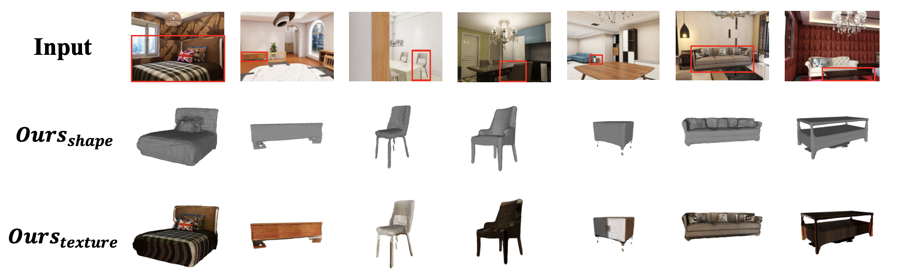

# DF3D: Diffusion-Guided Multi-Modal Fusion for Single-View 3D Reconstruction

## Overview
DF3D is a deep learning framework designed for single-view 3D reconstruction. This project combines geometry and texture information, leveraging depth priors to enhance reconstruction quality, making it suitable for generating high-fidelity 3D models in complex scenes.

---

## Pipeline

The pipeline of DF3D is shown below:


---

## Results

### Geometry Reconstruction
The geometry reconstruction results are shown below:



### Texture Reconstruction
The texture reconstruction results are shown below:



---

## Setup

Follow these steps to set up the environment:

```bash
conda create -n DF3D python=3.8 
conda activate DF3D

pip install -r requirements.txt
```


## Dataset Preparation

We use the 3D-FRONT dataset as the main data source for training and testing.

**Dataset Reference**:
```bibtex
@article{fu20203dfront,
  title={3D-FRONT: 3D Furnished Rooms with layOuts and semaNTics},
  author={Fu, Huan and Cai, Bowen and Gao, Lin and Zhang, Lingxiao and Li, Cao and Zeng, Qixun and Sun, Chengyue 
          and Fei, Yiyun and Zheng, Yu and Li, Ying and Liu, Yi and Liu, Peng and Ma, Lin and Weng, Le and Hu, Xiaohang
          and Ma, Xin and Qian, Qian and Jia, Rongfei and Zhao, Binqiang and Zhang, Hao},
  journal={arXiv preprint arXiv:2011.09127},
  year={2020}
}
```
**Download and Extraction**
Download the dataset from the following link:

The dataset can be downloaded from: https://drive.google.com/file/d/1j0n4J7XBqK1np5v7sxZGKBhqMg6qTG4Y/view

After downloading, extract it to the data folder in the project root directory.

## Depth Prior Generation
Before geometry and texture reconstruction, each image in the dataset requires a corresponding depth prior image. The following command shows how to run the depth prior generator:

```bash
python -m depth_pri.run --input_img_path  --Output_img_path
```
Please ensure that all images in your dataset have their corresponding depth prior maps before proceeding.

Reference:
```bibtex
@InProceedings{ke2023repurposing,
title={Repurposing Diffusion-Based Image Generators for Monocular Depth Estimation},
author={Bingxin Ke and Anton Obukhov and Shengyu Huang and Nando Metzger and Rodrigo Caye Daudt and Konrad Schindler},
booktitle = {Proceedings of the IEEE/CVF Conference on Computer Vision and Pattern Recognition (CVPR)},
year={2024}
}
```

## Training
Run the following command to start training:
```bash
python -m train.train --config train.yaml
```


## Inference
Run the following command for inference:
```bash
python inference.py --config train.yaml
```

## Evaluation
The project provides evaluation on the following metrics:
--Chamfer Distance
--F-score
--Normal Consistency
--PSNR
--IoU
