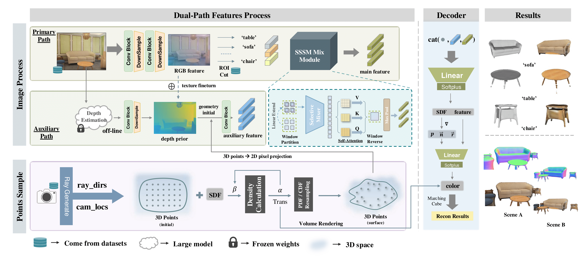
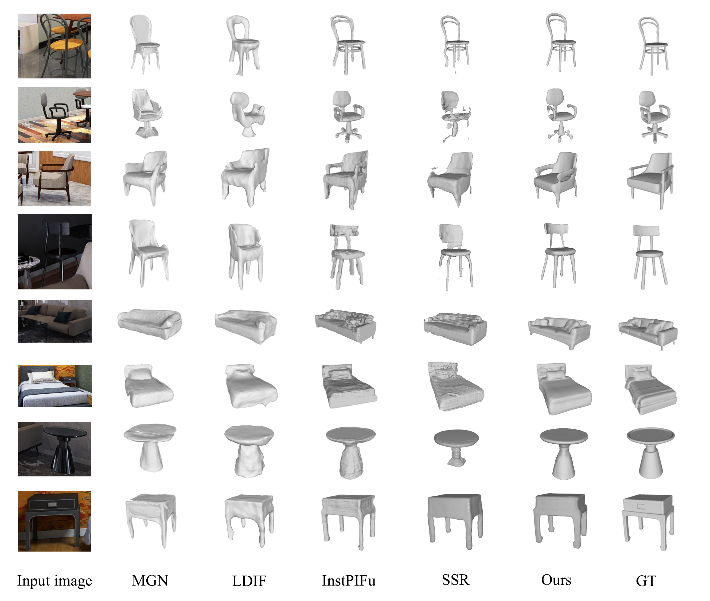
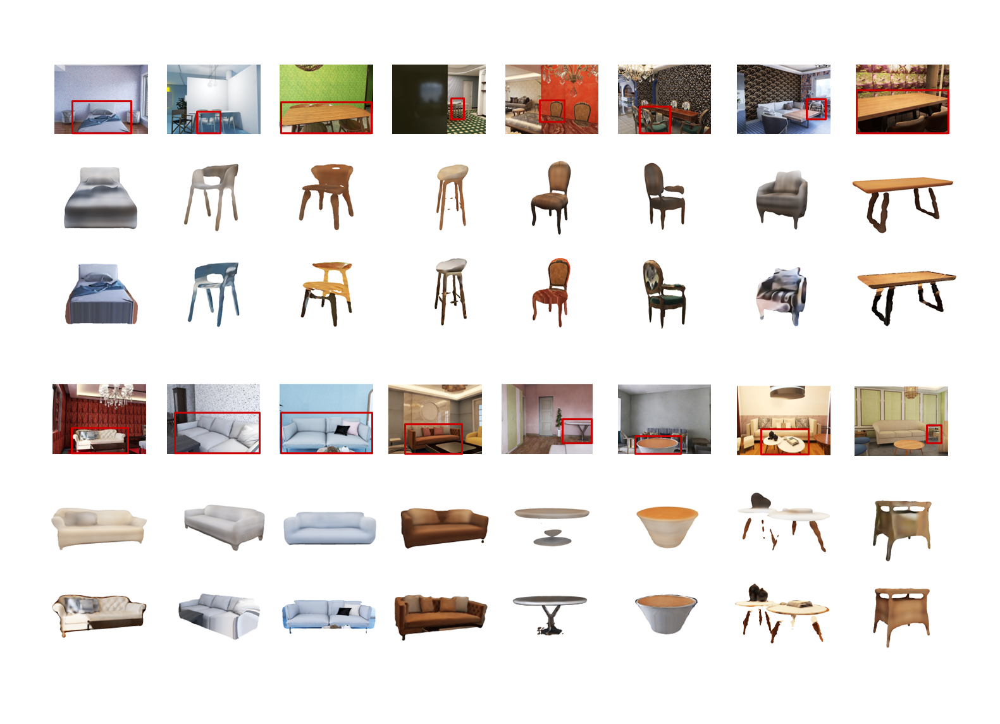

# Single-view 3D Scene Reconstruction with High-fidelity Shape and Texture (M3D Framework)

[](chrome-extension://efaidnbmnnnibpcajpcglclefindmkaj/https://arxiv.org/pdf/2411.12635)
[](https://arxiv.org/abs/2411.12635)

---
## Overview

M3D is a high-fidelity framework for reconstructing 3D scenes and objects from a single RGB image. This framework combines state-of-the-art dual-stream feature extraction and depth-driven methodologies to deliver superior performance in challenging scenarios, such as virtual reality, autonomous driving, and robotics.

---
## Workflow
The pipeline of M3D is shown below:



---

## Results Show

### Geometry Reconstruction



### Render Reconstruction



### Compose Result


## Prepare Start
### Environment Prepare
Follow these steps to set up the environment:

```bash
conda create -n DF3D python=3.8 
conda activate DF3D

pip install -r requirements.txt
```
---
If there are any environment problems, welcome to give us comments to discuss about it.

### Datasets Prepare

We use the **3D-FRONT** dataset as the main data source for training and testing.

**Dataset Reference**:
```bibtex
@article{fu20203dfront,
  title={3D-FRONT: 3D Furnished Rooms with layOuts and semaNTics},
  author={Fu, Huan and Cai, Bowen and Gao, Lin and Zhang, Lingxiao and Li, Cao and Zeng, Qixun and Sun, Chengyue 
          and Fei, Yiyun and Zheng, Yu and Li, Ying and Liu, Yi and Liu, Peng and Ma, Lin and Weng, Le and Hu, Xiaohang
          and Ma, Xin and Qian, Qian and Jia, Rongfei and Zhao, Binqiang and Zhang, Hao},
  journal={arXiv preprint arXiv:2011.09127},
  year={2020}
}
```
**Dataset Split**  
We split the datasets as train / val / test into 'data_split' folder


**Dataset Prepare**  
Download the dataset from the following link:

The dataset can be downloaded from: [3DFRONT](https://drive.google.com/file/d/1j0n4J7XBqK1np5v7sxZGKBhqMg6qTG4Y/view)

After downloading, extract it to the 'data' folder in the project root directory.

---
## Depth Prior Generation

```bash
cd depth_pri
python run.py --encoder vitb --img-path ../data/FRONT3D/train/rgb --outdir ../depth_anything_png  --pred-only  --grayscale
python run.py --encoder vitb --img-path ../data/FRONT3D/val/rgb --outdir ../depth_anything_png  --pred-only  --grayscale
python run.py --encoder vitb --img-path ../data/FRONT3D/test/rgb --outdir ../depth_anything_png  --pred-only  --grayscale
cd ..
python utils/depth_utils/png_tran_npy.py
```
---
For more depth estimation command rules:
```bash
python run.py --encoder <vits | vitb | vitl> --img-path  --outdir <outdir> [--pred-only] [--grayscale]
```
Arguments:
- ``--img-path``: you can either 1) point it to an image directory storing all interested images, 2) point it to a single image, or 3) point it to a text file storing all image paths.
- ``--pred-only`` is set to save the predicted depth map only. Without it, by default, we visualize both image and its depth map side by side.
- ``--grayscale`` is set to save the grayscale depth map. Without it, by default, we apply a color palette to the depth map.
---
Because we use limited GPU, so we choose offline to get the depth prior information.
Here, we choose the DepthAnthing to generate the depth prior, and you could choose any other depth estimation method to get the depth information prior.
And after this step, we could get the 'depth_anything' folder, which saved the depth prior information

reference:
```bibtex
@inproceedings{depthanything,
      title={Depth Anything: Unleashing the Power of Large-Scale Unlabeled Data}, 
      author={Yang, Lihe and Kang, Bingyi and Huang, Zilong and Xu, Xiaogang and Feng, Jiashi and Zhao, Hengshuang},
      booktitle={CVPR},
      year={2024}
}
```

## Train
```bash
python train.py --config train.yaml
```
we set the batchsize = 30, lr = 0.00006, you can try more parameters.

set show_rendering=False

## Inference
```bash
python inference.py --config train.yaml
```

set show_rendering=False, eval.export_mesh=True, eval.export_color_mesh=True


## evaluation
In preparing......


## Project Status

This project is currently in **active development**, with continuous refinements and improvements.


We welcome contributions and suggestions to help improve the project further!

---

If you use this project or parts of the framework in your research, please consider citing:

```bibtex
@misc{zhang2024m3ddualstreamselectivestate,
      title={M3D: Dual-Stream Selective State Spaces and Depth-Driven Framework for High-Fidelity Single-View 3D Reconstruction}, 
      author={Luoxi Zhang and Pragyan Shrestha and Yu Zhou and Chun Xie and Itaru Kitahara},
      year={2024},
      eprint={2411.12635},
      archivePrefix={arXiv},
      primaryClass={cs.CV},
      url={https://arxiv.org/abs/2411.12635}, 
}